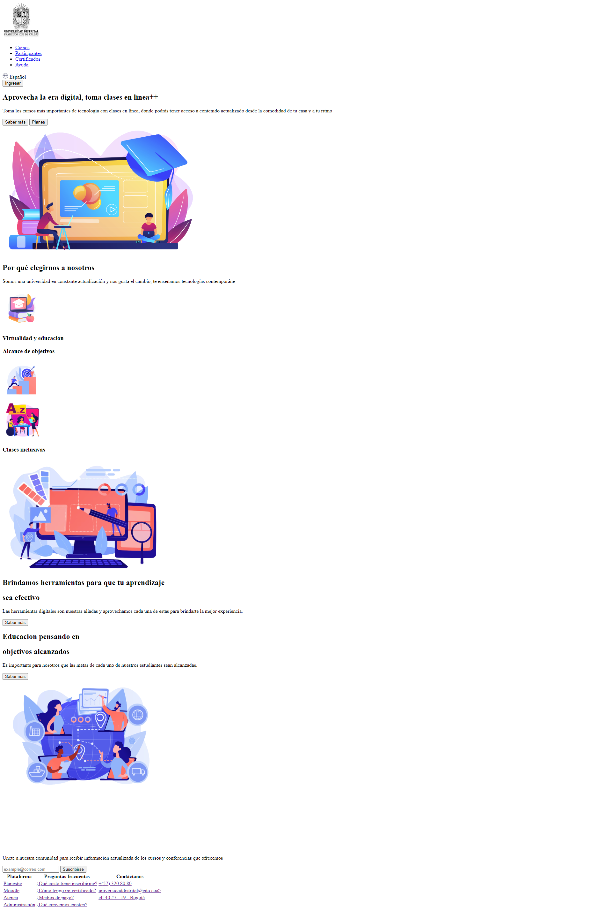
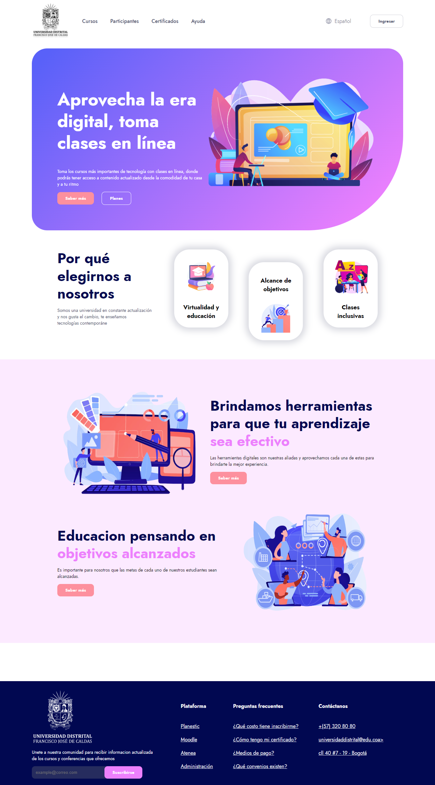
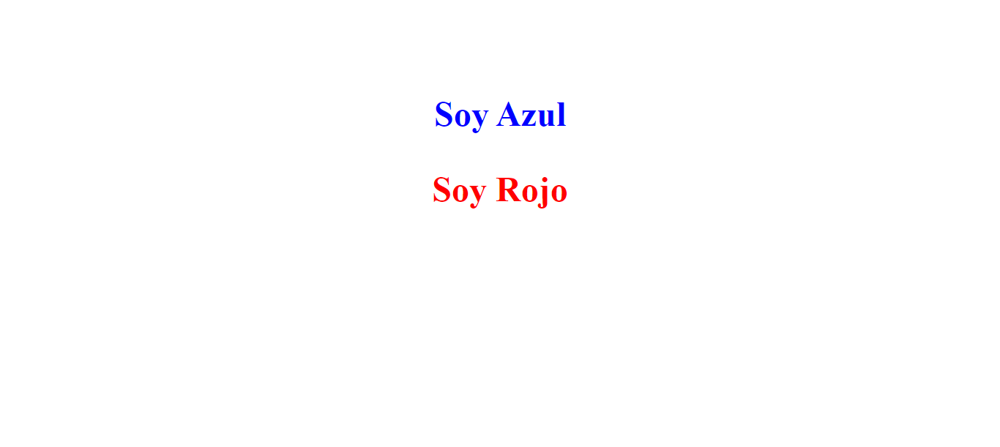
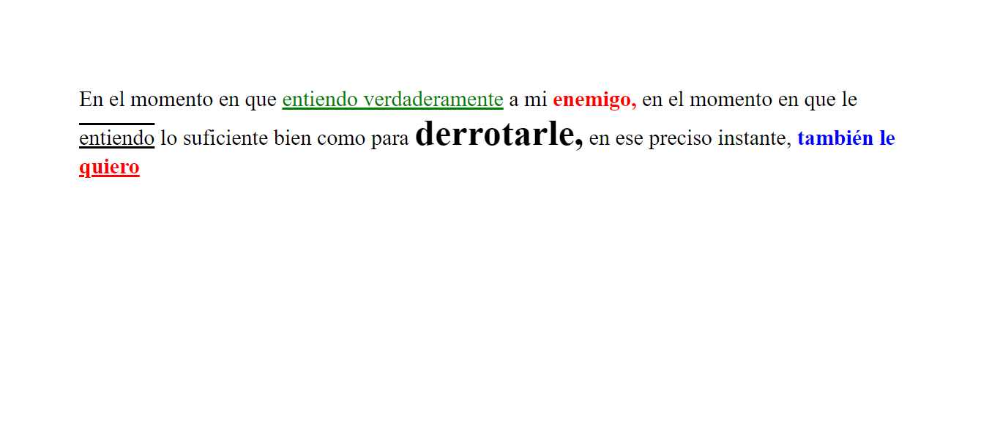
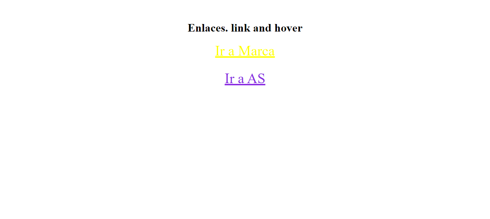
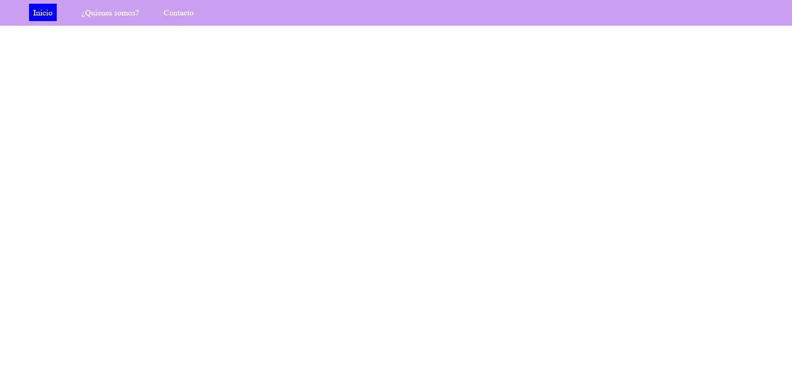
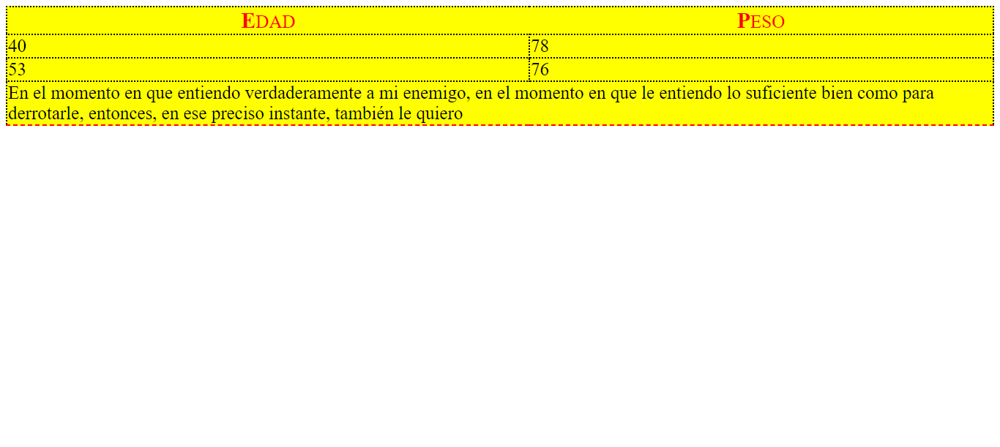

<h1>Taller9 - Laura Sofía Oviedo García</h1>

<h2>Información</h2>

Curso: Full Stack Básico - grupo1

Profesor:Cristian Patiño

<h2>Link de la pagina web</h2>
<a href="https://sofiaoviedo24.github.io/taller-9-full-stack/">Link página web</a>

<h2>Punto 1: Link de Figma</h2>
<a href="https://www.figma.com/file/a6Ikc1No7sOSbStKn45FV2/Laura-Sofia-Oviedo-Garcia?type=design&node-id=0%3A1&mode=design&t=bapSHIYHrbpNcNJO-1">Link de Figma</a>

<h2>Punto 2: Diseño en HTML</h2>

<h2>Punto 3: Diseño con CSS</h2>

<h2>Punto 4: Títulos</h2>

<h2>Punto 5: Párrafo</h2>

<h2>Punto 6: Links </h2>

<h2>Punto 7 y 8: Navegación</h2>

<h2>Punto 9: Tabla</h2>

